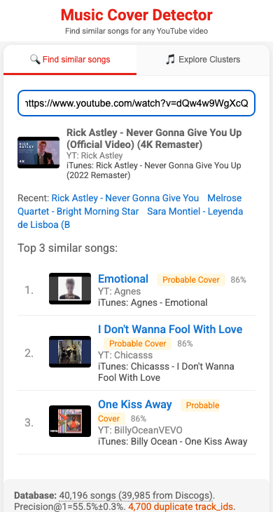

# yt-SongSpace

Interactive 3D visualization and clustering of song embeddings to explore musical style similarities.

A spin-off of [yt-CoverHunter](https://github.com/muoten/yt-CoverHunter).

[](https://muoten.github.io/yt-SongSpace/)

## Features

- **Cluster Analysis** — Groups songs into clusters based on embedding similarity, revealing musical style patterns
- **3D Visualization** — Interactive UMAP projection of 128-dimensional song embeddings
- **Style Labels** — Automatically identifies musical styles (Jazz, Blues, Country, Pop, etc.) with representative artists
- **Easy Exploration** — Dropdown menu and legend controls to isolate and explore specific clusters

## Installation

```bash
pip install -r requirements.txt
```

## Usage

### 1. Cluster Analysis

Analyze song embeddings and identify patterns:

```bash
python cluster_analysis.py
```

Outputs:
- Cluster statistics and characteristics
- `clustered_songs.csv` — Songs with cluster assignments

### 2. Visualization

Generate interactive 3D visualization:

```bash
python visualize_clusters_final.py
```

Outputs:
- `clusters_3d_final.html` — Open in browser to explore

### Controls

- **Dropdown menu** (top-left): Select a cluster to isolate
- **Double-click legend**: Isolate a single cluster
- **Single-click legend**: Toggle clusters on/off
- **Drag**: Rotate the 3D view
- **Scroll**: Zoom in/out

## Data Format

### Input Files

- `vectors_without_metadata_v4.tsv` — Song embeddings (N × 128 dimensions, tab-separated)
- `metadata_clean_v4.tsv` — Song metadata (youtube_id, title, channel, view_count, etc.)

### Output Files

- `clustered_songs.csv` — Songs with cluster assignments
- `clusters_3d_final.html` — Interactive visualization

## Musical Styles Identified

The clustering reveals distinct musical regions:

| Style | Representative Artists |
|-------|----------------------|
| Vintage Swing & Big Band | Duke Ellington, Nat King Cole |
| Cool Jazz & Bebop | Stan Getz, Chet Baker |
| Chicago & Delta Blues | Muddy Waters, Memphis Slim |
| Classic Country | George Jones, Willie Nelson |
| Modern Pop Hits | Taylor Swift, Britney Spears |
| Electronic & Dance | Calvin Harris, EDM |

## License

MIT
