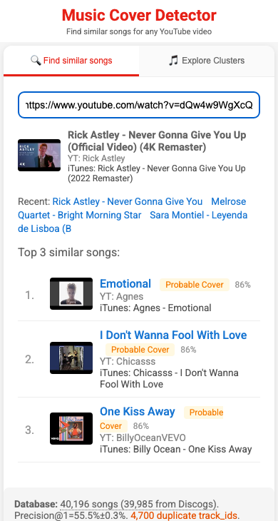

# Music Cover Detector

A cover song detection engine that identifies similar songs by comparing audio embeddings. Paste a YouTube link or search by title/artist, and it finds acoustically similar tracks across a database of ~100,000 songs.

Live at [coverdetector.com](https://coverdetector.com)

[](https://coverdetector.com)

## How it works

1. Looks up the YouTube video title and artist
2. Finds the matching track on iTunes and downloads a 30-second preview
3. Computes audio embeddings using CoverHunter (128-dim) and LIVI (768-dim)
4. Compares against the database using fused cosine similarity (CoverHunter + LIVI)
5. Returns the most similar songs with similarity scores

## Features

- **Cover song search** — Find covers and similar versions of any song via YouTube URL
- **Title/artist search** — Search the database by song title or artist name
- **Two models** — CoverHunter (128-dim) and LIVI (768-dim), with score fusion
- **3D embedding space** — Interactive UMAP visualization of the song database
- **Automated crawling** — Continuous indexing of new songs with dedup and verification
- **Precision@1 tracking** — Live accuracy metric against Discogs ground truth

## Architecture

- **Backend**: Flask API serving embeddings and search (`discogs-coverhunter-itunes/api.py`)
- **Frontend**: Single-page Material Design app (`docs/index.html`)
- **Data**: Discogs-VI-YT dataset (~200K URLs from ~48K cliques), ~100K indexed with embeddings
- **Deployment**: Docker on Hetzner via Coolify, persistent volume for embeddings

## Local development

```bash
pip install -r requirements.txt
python discogs-coverhunter-itunes/api.py
```

The API starts at `http://localhost:5000`. Requires `vectors.csv` (CoverHunter embeddings) and optionally `vectors_livi.csv` (LIVI embeddings for fusion).

## Crawling

Index new songs from the Discogs-VI-YT dataset:

```bash
python crawl_songs.py
```

Three phases:
1. **Phase 0** — Re-verify songs missing track_id mappings
2. **Phase 1** — Re-crawl duplicate track_ids with artist verification
3. **Phase 2** — Index new unprocessed songs

## Data

- `vectors.csv` — CoverHunter embeddings (youtube_id + 128-dim vector)
- `vectors_livi.csv` — LIVI embeddings (youtube_id + 768-dim vector)
- `videos_to_test.csv` — YouTube videos from Discogs-VI-YT dataset (~120K URLs)
- `discogs_cliques.txt` — Source of truth for which Discogs cliques are included
- `docs/*.json` — Precomputed visualization data for GitHub Pages

## Credits

- Dataset: [Discogs-VI](https://github.com/MTG/discogs-vi-dataset) (MTG, Universitat Pompeu Fabra)
- CoverHunter model: [Liu et al.](https://arxiv.org/abs/2306.09025)
- LIVI model: [Deezer LIVI](https://github.com/deezer/LIVI-Lyrics-Informed-Version-Identification)

## License

MIT
